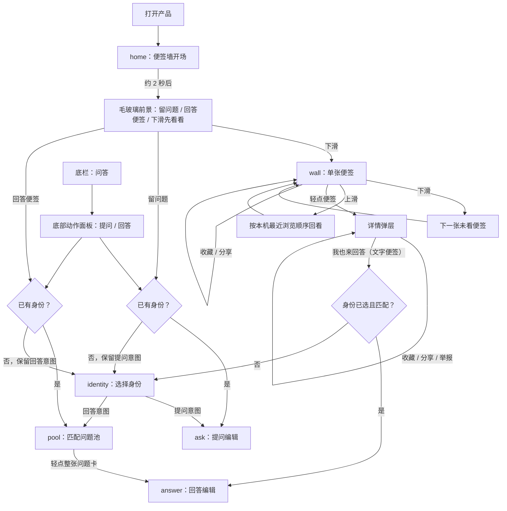
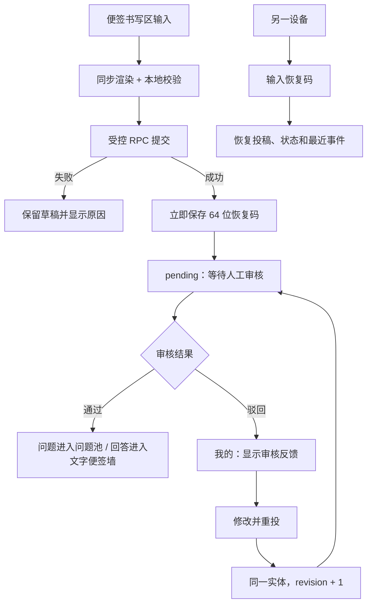
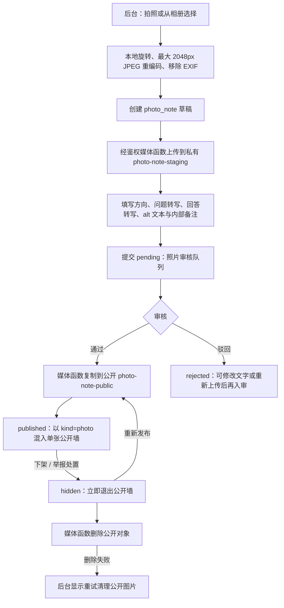
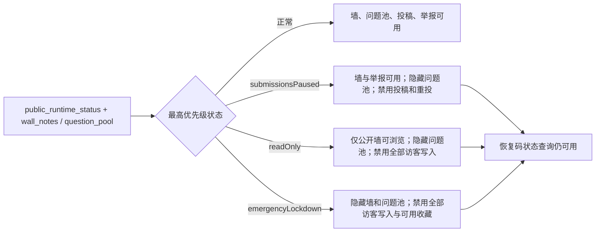

# 页面、流程与状态

本文描述当前移动端前台、审核后台与 Supabase schema v4 已实现的流程。Mermaid 源码可直接修改节点和连线，作为产品、设计与研发共同维护的流程图。

## 1. 页面清单

| ID | 路由/页面 | 可访问角色 | 主要任务 |
| --- | --- | --- | --- |
| H01 | `home` 沉浸式入口 | 所有人 | 首次完整展示便签墙约 2 秒，随后叠加毛玻璃；留问题、回答便签，或下滑浏览 |
| W01 | `wall` 单张留言墙 | 所有人 | 一次展示一张文字或实体照片便签；下滑下一张、上滑按最近浏览顺序回看 |
| W02 | 便签详情弹层 | 所有人 | 文字便签查看同题公开回答；实体照片查看原图、转写和无障碍描述；均可收藏、分享、举报 |
| A01 | `identity` 身份选择 | 未选择身份的参与者 | 选择“大朋友”或“小朋友”，立即继续原本的提问/回答意图 |
| A02 | 问答底部动作面板 | 所有人 | 从底栏“问答”或桌面导航打开，选择“提个问题”或“去回答”；不是独立主导航页 |
| Q01 | `ask` 提问编辑 | 已选择身份的参与者 | 在便签书写区同步输入和渲染问题，选择匿名方式并提交 |
| R01 | `pool` 待回答问题池 | 已选择身份的参与者 | 浏览当前身份可回答的开放问题；整张问题卡进入回答 |
| R02 | `answer` 回答编辑 | 已选择身份的参与者 | 在便签书写区同步输入和渲染回答并提交 |
| M01 | `mine` 我的 | 所有人 | 查看本机投稿、审核消息、收藏及恢复码；收藏可再次打开和分享 |
| O01 | `admin.html` 运营后台 | 白名单管理员 | 审核文本问答/举报、采集实体便签照片、审核、发布、下架、精选、审计和运行开关 |

移动端底栏固定为“墙 / 问答 / 我的”。“问答”打开动作面板，不增加中间的独立参与页；兼容保留的 `#participate` 链接会归一为打开该面板。`#discover` 同样归一为 `#wall`。

## 2. 访问、浏览与轻量参与

浏览不要求身份。首页及底栏发起参与时，只在真正需要时选择一次身份；选完会直接进入原意图。提问草稿按身份保存，回答草稿按问题保存。前台展示称谓为“大朋友/小朋友”，数据库角色值仍为 `adult/child`。

移动端浏览页采用固定视口单卡，页面本身不纵向滚动；详情弹层独立滚动。当前卡片只有收藏和分享快捷动作，避免堆叠“下一张”等重复按钮。文字便签使用拟物模板；实体便签显示已审核发布的原始照片及其转写。

## 3. 文本投稿、审核与恢复

“我的”在应用启动时静默同步恢复码关联的投稿，用户也可手动刷新；这不是实时推送。恢复码默认有效 365 天，是可重复使用的持有者凭证，必须私密保存。当前没有全局幂等键：服务端成功但响应丢失后重试，仍可能产生重复文本投稿。

## 4. 实体便签照片采集、审核与清理

实体便签只由登录且位于管理员白名单的运营人员采集；普通访客不能上传，也不能读取待审照片或私有存储桶。

照片入审前必须有方向、问题转写、回答转写、无障碍描述及已上传图片。后台可核对文字、驳回、精选/取消精选、下架、重试清理公开图片或重新发布。涉及公开 Storage 的通过、重新发布、下架、公开媒体清理，以及“下架并解决”照片举报，均只能通过 Edge Function 执行；重新发布前会清理旧公开对象。公开对象仅在发布后由 `wall_notes` 投影。公开墙和分享层只接受当前项目 `photo-note-public` 的受控路径，照片便签的 `questionId`、`answerId` 均为 `null`。

## 5. 当前状态矩阵

### 5.1 文本问题

| 状态 | 公开问题池 | 文字便签墙 | 投稿者当前可执行 |
| --- | --- | --- | --- |
| `draft` | 否 | 否 | 继续编辑；仅本机状态 |
| `pending` | 否 | 否 | 查看状态与事件 |
| `open` | 是 | 有公开回答时可见 | 查看状态与收到回答事件 |
| `closed` | 否 | 有公开回答时可见 | 查看状态 |
| `rejected` | 否 | 否 | 查看反馈、修改并重投 |
| `hidden` | 否 | 否 | 查看处置反馈 |

### 5.2 文本回答

| 状态 | 公开墙 | 回答者当前可执行 |
| --- | --- | --- |
| `draft` | 否 | 继续编辑；仅本机状态 |
| `pending` | 否 | 查看状态与事件 |
| `published` | 是 | 查看状态；在公开墙中打开、收藏、分享 |
| `rejected` | 否 | 查看反馈；原问题开放时可修改并重投 |
| `hidden` | 否 | 查看处置反馈 |

### 5.3 实体照片便签

| 状态 | 私有预览 | 公开墙/分享 | 后台当前可执行 |
| --- | --- | --- | --- |
| `draft` | 仅管理员 | 否 | 编辑、上传或重拍 |
| `pending` | 仅管理员 | 否 | 核对文字、通过或驳回 |
| `published` | 管理员可预览 | 是 | 设为精选、下架 |
| `rejected` | 仅管理员 | 否 | 修改或重新上传、再次提交 |
| `hidden` | 仅管理员 | 否 | 重试清理公开图片、重新发布 |

## 6. 推荐、回看、收藏与分享

- 无主题分类或手动排序筛选；公开内容默认按精选优先、发布时间倒序进入推荐候选。
- Cookie 记录最近进入前景的便签 ID（上限 100、180 天），刷新后优先推荐未看便签；Cookie 不可用时降级为本次访问内存去重。
- `localStorage` 另存最多 60 条有序近期浏览 ID，上滑只在这些有效 ID 内回看，不消耗新推荐；被下架的 ID 会在内容同步或单条复核时移除。
- 浏览到可用内容末尾停在结束状态，不自动循环；有新的公开便签后，定时同步会恢复继续浏览。
- 收藏按最近操作顺序保存在本机，并保存受限长度的便签快照；联网时会重新校验公开状态，下架或紧急关闭时不再展示为可用收藏。
- 分享使用移动端底部动作面板，生成完成后直接展示最终图片预览，并提供“分享便签图片 / 保存图片 / 复制链接”。预览、分享和保存复用同一个缓存 Blob，不重复渲染；文字便签在浏览器合成 PNG，实体便签使用已验证的公开原图。系统分享不可用时降级为复制链接和下载。
- 分享链接携带 `?note=<note_id>`，打开后复核公开状态；已隐藏、无效或紧急关闭的内容不会打开。

## 7. 内容同步与运营状态

前台初始化会拉取公开运行状态和内容快照。在线时每 20 秒轮询运行状态，并在页面重新获得焦点、联网或从后台回到前台时同步；状态变化或公开内容变更会刷新墙、问题池、收藏校验和推荐历史。没有 WebSocket 实时订阅。

三个开关可同时启用，优先级为 `emergencyLockdown`、`readOnly`、`submissionsPaused`。后台可以附加最长 160 字的公开说明。`reviewer` 可读取状态，只有 `owner` 可修改；每次修改都写入审核操作日志。

## 8. 异常与边界

| 场景 | 当前处理 |
| --- | --- |
| 游客从分享入口打开公开便签 | 直接浏览，无需身份；先复核公开状态 |
| 游客点击“我也来回答” | 选择身份后回到原题；不匹配则进入适合的问题池 |
| 编辑回答期间原问题关闭 | 保留草稿，提交时返回原问题不可回答 |
| 文本投稿被驳回 | “我的”显示反馈，仅此状态允许凭恢复码修改重投 |
| 实体照片被下架 | 即刻从公开视图移除；后台继续清理公开对象，失败可重试 |
| 当前推荐看完 | 停在结束状态，可上滑回看；新内容同步后继续 |
| 清除站点数据 | 身份、草稿、收藏、近期回看、Cookie 已看记录和本机恢复码副本丢失；已保存的恢复码仍可手动恢复文本投稿 |

## 9. 移动端验收范围

原型以 320-430px 手机视口为首要验收范围：

1. 首页开场、毛玻璃背景、提问/回答入口与下滑浏览连续可用。
2. 公开墙一次只展示一张文字或照片便签；连续下滑、上滑回看、轻点详情均正确。
3. 底栏只展示“墙 / 问答 / 我的”，问答打开底部动作面板。
4. 提问或回答仅在需要时选择一次身份，编辑区直接同步呈现内容并保留草稿。
5. 收藏、分享图片、保存前预览、保存图片、复制链接与已下架内容拦截正确。
6. 后台可完成照片采集、转写、私有上传、入审、发布、下架、清理/重试和重新发布。
7. 20 秒同步及 focus/online/visible 同步后，发布和下架内容会正确进入或离开公开墙与近期回看。
