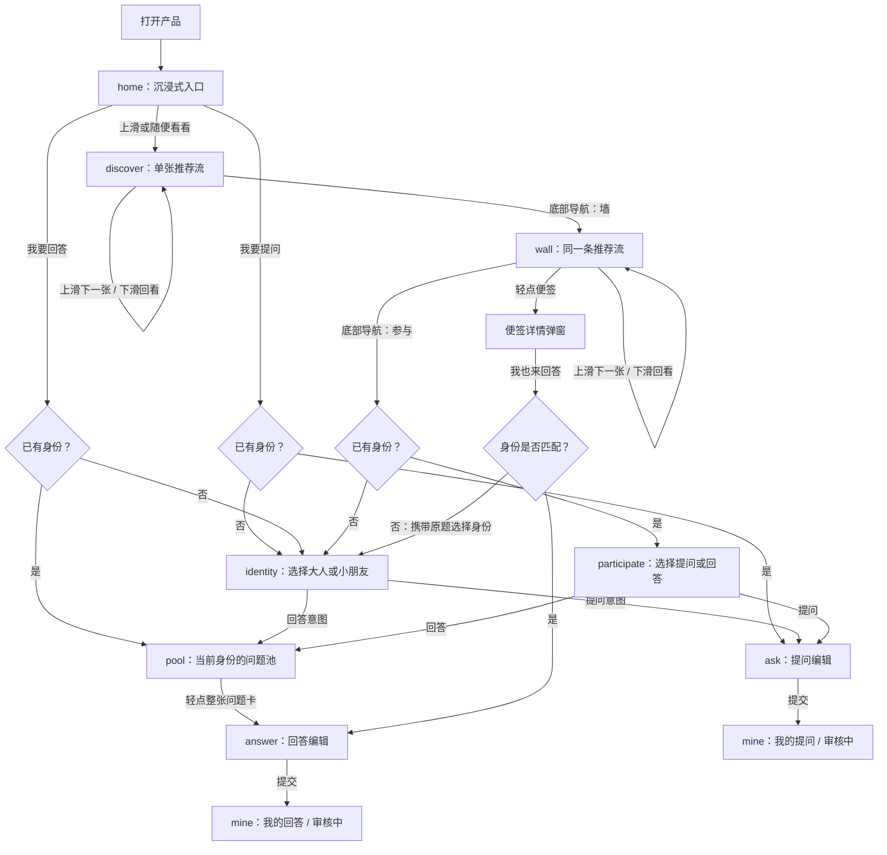
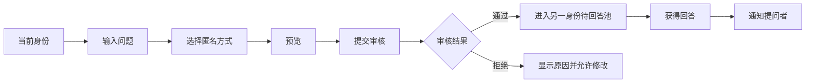
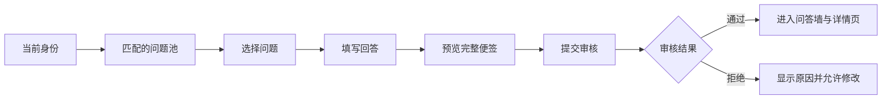

# 页面、流程与状态

## 1. 页面清单

| ID | 页面 | 可访问角色 | 主要任务 |
| --- | --- | --- | --- |
| H01 | 沉浸式入口 | 所有人 | 选择提问、回答或进入自由浏览 |
| W01 | 推荐问答墙 | 所有人 | 以单张推荐流浏览和打开便签 |
| W03 | 随便看看 | 游客/所有人 | 不选择身份，直接进入同一条推荐流 |
| W02 | 便签详情 | 所有人 | 查看问题及全部回答 |
| A01 | 身份选择 | 未选择身份的参与者 | 选择大人或小朋友 |
| A02 | 身份首页 | 已选择身份的参与者 | 选择提问或回答 |
| Q01 | 提问编辑 | 已选择身份的参与者 | 写问题、选择匿名方式、预览 |
| Q02 | 提交结果 | 提问者 | 正式产品页面；当前原型由提示消息和“我的”承担 |
| R01 | 待回答问题池 | 已选择身份的参与者 | 挑选当前身份可回答的问题 |
| R02 | 回答编辑 | 已选择身份的参与者 | 写回答并预览完整便签 |
| M01 | 我的 | 参与者 | 查看问题、回答、收藏、通知和审核状态 |
| O01 | 运营后台 | 运营/管理员 | 审核、精选与数据 |

## 2. 入口与身份流程

规则：浏览不触发身份选择。身份选择完成后直接执行用户刚才的动作；“我要回答”不会再经过参与中转页。提问草稿按身份分别保存，回答草稿按题目保存。

> 第 3-5 节描述正式产品的审核目标。当前前端原型提交后只写入本地 `pending` 状态并进入“我的”，尚未实现审核通过、驳回和公开发布。

## 3. 提问流程

## 4. 回答流程

## 5. 关键状态矩阵

### 5.1 问题状态

| 状态 | 提问者可见 | 问题池可见 | 问答墙可见 | 可执行动作 |
| --- | --- | --- | --- | --- |
| draft | 是 | 否 | 否 | 编辑、删除 |
| pending | 是 | 否 | 否 | 撤回 |
| open | 是 | 是 | 有已发布回答时可见 | 关闭、分享详情 |
| closed | 是 | 否 | 有已发布回答时可见 | 查看 |
| rejected | 是 | 否 | 否 | 修改、删除 |
| hidden | 是 | 否 | 否 | 申诉或查看处置原因 |
| archived | 是 | 否 | 按策略决定 | 查看 |

### 5.2 回答状态

| 状态 | 回答者可见 | 提问者可见 | 问答墙可见 | 可执行动作 |
| --- | --- | --- | --- | --- |
| draft | 是 | 否 | 否 | 编辑、删除 |
| pending | 是 | 否 | 否 | 撤回 |
| published | 是 | 是 | 是 | 分享、举报 |
| rejected | 是 | 否 | 否 | 修改、删除 |
| hidden | 是 | 视策略 | 否 | 申诉或查看原因 |

## 6. 推荐浏览规则

- 问答墙没有内容分类或排序筛选，默认就是推荐。
- 手机端采用固定视口单卡：上滑推荐下一张、下滑回看本次会话中的上一张、轻点便签看详情。
- 浏览页本身不纵向滚动，横向手势保留给浏览器和系统；详情页继续独立滚动。
- 手机端隐藏前后按钮、“再看一张”、顶栏随机和重复的“打开问答墙”按钮。
- 问题池采用纵向滚动，整张问题卡可轻点进入回答，不再为每张卡重复放置 CTA 按钮。
- wall 和 discover 共用同一条推荐历史，切换路由不会回到第一张。
- 当前原型用 Cookie 保存已进入前景的便签 ID；刷新或再次进入时只选择未看内容。
- 下滑只回看本次会话历史，不会消费新的推荐内容。
- 当前内容全部看完后停止自动推荐，不取模回到首张；新内容出现后再继续。
- Cookie 只承担原型级近期去重。正式产品使用匿名浏览标识，并由服务端保存更长的已看历史。
- 所有公开查询只返回审核通过、未隐藏且已形成至少一个回答的内容。

## 7. 异常与边界情况

| 场景 | 产品处理 |
| --- | --- |
| 游客从分享链接打开便签 | 直接进入详情，不要求身份 |
| 游客点击回答 | 选择身份后返回原问题；身份不匹配时说明原因并提供问题池 |
| 问题在用户编辑回答时关闭 | 保留草稿，提示问题已关闭，不允许提交 |
| 问题达到回答上限 | 从问题池移除，详情仍可浏览 |
| 提交超时或断网 | 保留草稿，提供重试，不生成重复记录 |
| 内容审核拒绝 | 显示可理解的原因和可修改入口 |
| 卡片被隐藏 | 从所有公开列表立即移除，后台保留审计记录 |
| 当前推荐已看完 | 停在结束状态，等待新内容，不自动循环旧便签 |
| Cookie 损坏或不可用 | 忽略异常记录并降级为本次访问内存去重 |
| 身份切换时存在草稿 | 明示草稿归属并要求用户确认 |
| 预置内容 | 前台与用户内容同样展示，后台可按来源筛选 |

## 8. 低保真原型覆盖范围

原型以 360-430px 手机视口为首要验收范围，需要可以演示：

1. 游客进入后先看到沉浸式入口；可直接选择“随便看看”。
2. 随便看看和问答墙共用单张推荐流，移动端以上下滑动为主要切换方式。
3. 浏览页不展示内容分类或排序筛选，默认推荐且自动排除已看便签。
4. 打开便签详情并查看多个回答。
5. 游客从“我要提问”或“我要回答”进入身份选择。
6. 选择身份后直接进入提问页或问题池，不再经过多余中转页。
7. 轻点整张问题卡进入回答并提交。
8. 查看“我的”中的问题、回答和通知。

审核后台不在低保真原型中完整实现，只显示内容状态；正式产品另做独立后台。
