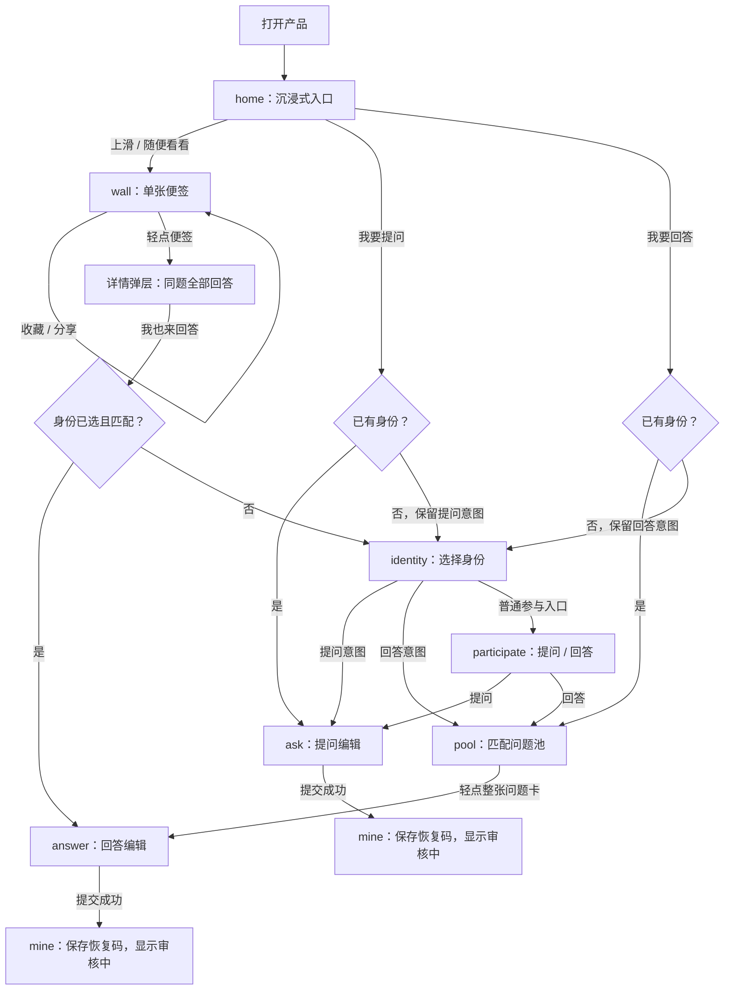
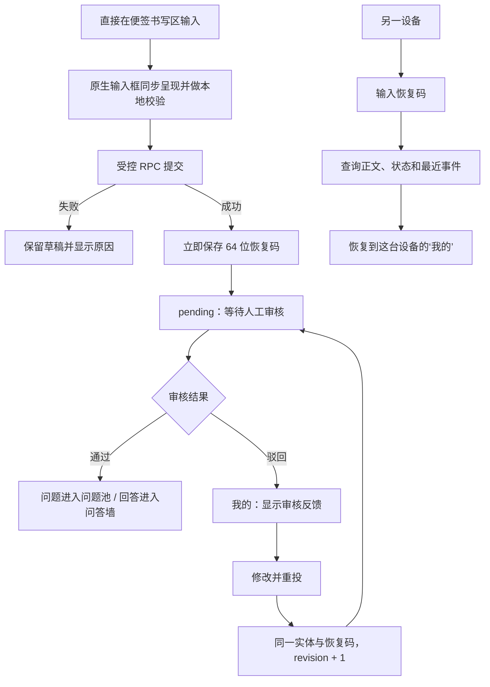
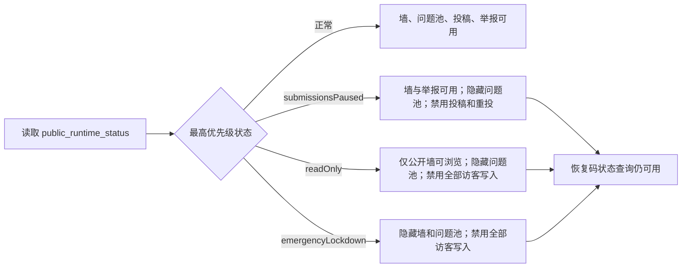

# 页面、流程与状态

本文描述当前移动端原型与 Supabase schema v3 已实现的流程。Mermaid 源码可直接修改节点和连线，作为产品、设计与研发共同维护的流程图。

## 1. 页面清单

| ID | 路由/页面 | 可访问角色 | 主要任务 |
| --- | --- | --- | --- |
| H01 | `home` 沉浸式入口 | 所有人 | 选择提问、回答，或上滑进入浏览 |
| W01 | `wall` 单张问答墙 | 所有人 | 上下滑切换便签、快捷收藏或分享、轻点查看详情 |
| W02 | 便签详情弹层 | 所有人 | 查看同一问题的全部公开回答、收藏、分享或举报 |
| A01 | `identity` 身份选择 | 未选择身份的参与者 | 选择大人或小朋友，并继续刚才的动作 |
| A02 | `participate` 参与页 | 已选择身份的参与者 | 选择提问或回答 |
| Q01 | `ask` 提问编辑 | 已选择身份的参与者 | 在便签书写区输入问题、选择匿名方式并提交 |
| R01 | `pool` 待回答问题池 | 已选择身份的参与者 | 浏览当前身份可回答的问题 |
| R02 | `answer` 回答编辑 | 已选择身份的参与者 | 在便签书写区输入回答并提交 |
| M01 | `mine` 我的 | 所有人 | 查看本机记录与收藏、再次分享、同步状态、导入恢复码与驳回重投 |
| O01 | `admin.html` 运营后台 | 白名单管理员 | 审核、举报处置、日志和运行状态 |

`#wall` 是唯一的公开浏览路由；旧 `#discover` 链接会归一到 `#wall`，不再维护第二套浏览历史。

## 2. 主流程

浏览不要求身份。用户从首页发起提问或回答时，身份选择只出现一次；选完后直接继续原意图，不再经过多余确认页。提问草稿按身份保存，回答草稿按题目保存。

移动端以滑动为主：问答墙固定视口一次只显示一张便签，整张卡片可轻点，底部只提供收藏和分享两个快捷动作；问题池纵向滚动，整张问题卡进入回答。底部导航只保留“墙 / 参与 / 我的”，浏览页不再堆叠“下一张”“再看一张”等重复主按钮。

## 3. 提交、审核与恢复

“我的”通过 `get_submission_status` 在应用启动时静默同步，也可由用户手动刷新；它不是实时推送。只有 `rejected` 内容显示“修改并重投”；被驳回回答还要求原问题仍为 `open`。恢复码默认有效 365 天，是可重复使用的持有者凭证，必须保持私密。

当前没有全局幂等键。断网时草稿会保留，但若服务端已成功而成功响应丢失，用户再次提交可能产生重复问题；交互文案不能承诺“重试绝不重复”。

## 4. 当前状态矩阵

### 4.1 问题

| 状态 | 公开问题池 | 问答墙 | 投稿者当前可执行 |
| --- | --- | --- | --- |
| `draft` | 否 | 否 | 继续编辑；仅存在本机，不是数据库状态 |
| `pending` | 否 | 否 | 查看状态与事件 |
| `open` | 是 | 有公开回答时可见 | 查看状态与收到回答事件 |
| `closed` | 否 | 有公开回答时可见 | 查看状态 |
| `rejected` | 否 | 否 | 查看反馈、修改并重投 |
| `hidden` | 否 | 否 | 查看处置反馈 |

### 4.2 回答

| 状态 | 问答墙 | 回答者当前可执行 |
| --- | --- | --- |
| `draft` | 否 | 继续编辑；仅存在本机，不是数据库状态 |
| `pending` | 否 | 查看状态与事件 |
| `published` | 是 | 查看状态；在公开墙中打开并分享便签 |
| `rejected` | 否 | 查看反馈；原问题开放时可修改并重投 |
| `hidden` | 否 | 查看处置反馈 |

当前参与者端没有撤回、删除、主动关闭、申诉或归档功能，也没有回答数量上限。管理员可通过后台执行状态操作；这些能力不应被描述成普通用户按钮。

## 5. 推荐浏览规则

- 问答墙没有分类或排序筛选，默认按精选优先、发布时间倒序推荐。
- 手机端固定视口单卡：上滑进入下一张，下滑回看本次会话上一张，轻点打开详情。
- 当前便签下方提供收藏和分享快捷动作；收藏按最近操作顺序显示在“我的”，并保存便签快照，内容离开最新推荐窗口后仍可查看；联网初始化、打开和分享时会通过公开视图复核，已下架内容会失效。
- 当前便签会提前完成公开状态校验并将模板与文字合成为 PNG；准备完成后轻点分享即可直接打开系统分享面板。尚未准备的收藏便签第一次轻点只做准备并提示再次轻点，避免 iOS 丢失用户手势；不支持系统分享时降级为复制链接和图片下载。
- 浏览页本身不纵向滚动；详情弹层独立滚动，横向手势留给浏览器和系统。
- Cookie 保存近期已进入前景的便签 ID，页面刷新后优先选择未看内容；不可用时降级为本次访问内存去重。
- 下滑回看不会消费新推荐。当前内容看完后停在稳定结束页，不自动循环；出现新公开内容后再继续。
- 已看历史没有服务端同步，换设备会形成新的浏览历史。
- 公开查询只返回审核通过、未隐藏且已经形成问答的内容。官方预置和用户内容自然混排，不在前台显示来源。

## 6. 运营状态分支

三个开关可以同时启用，优先级为 `emergencyLockdown`、`readOnly`、`submissionsPaused`。后台可以附加最长 160 字的公开说明。`reviewer` 可读取状态，只有 `owner` 可修改；每次修改都写入审核操作日志。

## 7. 异常与边界

| 场景 | 当前处理 |
| --- | --- |
| 游客从分享入口打开公开便签 | 直接浏览，不要求身份 |
| 游客点击“我也来回答” | 选择身份后回到原题；身份不匹配则进入适合的问题池 |
| 编辑回答期间原问题关闭 | 保留草稿，提交时返回原问题不可回答 |
| 投稿被驳回 | “我的”显示审核反馈，仅此状态允许修改重投 |
| 恢复码无效、过期或撤销 | 统一提示无法找到；不会泄露实体是否曾存在 |
| 旧版投稿没有恢复码 | 只能保留本机旧记录，不能同步线上状态 |
| 超出频率限制 | 显示稍后再试；共享网络使用较高的聚合额度，但超大网络仍可能相互影响 |
| 输入网址、邮箱、手机号或尖括号 | 服务端拒绝；其他隐私信息仍依赖人工审核 |
| 当前推荐看完 | 停在结束状态，等待新内容，不自动循环 |
| 便签被隐藏 | 从公开视图移除，后台保留状态与审计记录 |
| 紧急关闭期间打开收藏 | 收藏暂时隐藏但不删除本地 ID 和快照，恢复开放后重新校验 |
| 清除浏览器数据 | 身份、草稿、收藏、已看记录和本机恢复码副本丢失；只有事先另存的恢复码可手动恢复投稿 |

## 8. 移动端验收范围

原型以 360-430px 手机视口为首要验收范围：

1. 首屏展示拟物便签墙背景和毛玻璃前景，提供提问、回答与上滑浏览三个入口。
2. 浏览时一次只展示一张完整便签，可连续上滑、下滑回看并轻点查看详情。
3. 提问或回答只在需要时选择一次身份，选完立即继续原动作。
4. 问题池整卡可点，编辑页直接在便签书写区输入，能保留草稿并处理提交失败。
5. 成功投稿进入“我的”，保存恢复码并可同步审核结果。
6. 驳回内容可按反馈修改重投；恢复码可在另一浏览器导入。
7. 暂停投稿、只读和紧急关闭分别符合第 6 节矩阵。
8. 浏览器返回、刷新与详情关闭不会跳回错误路由或重置当前推荐。
